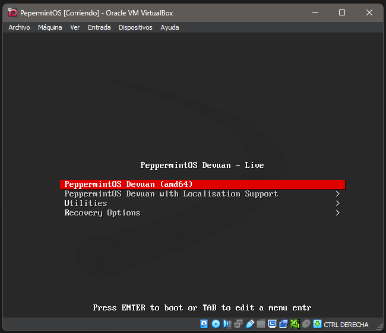
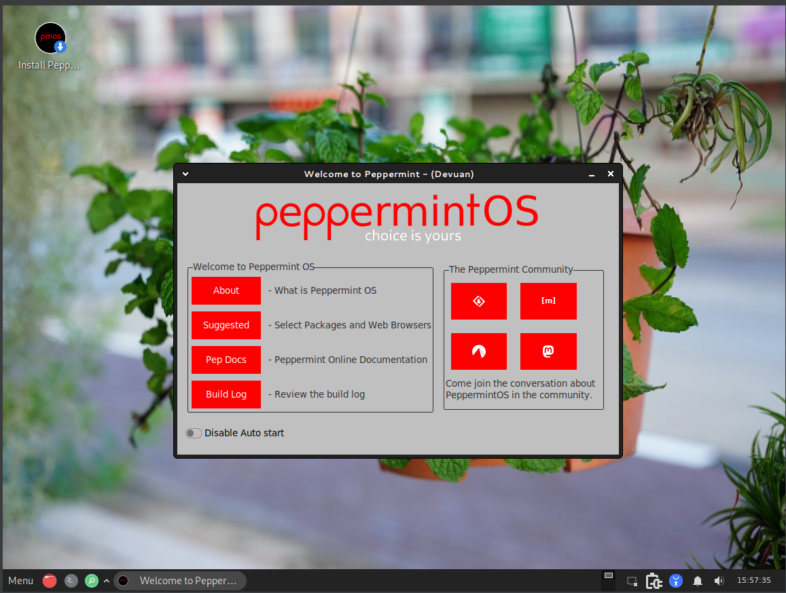
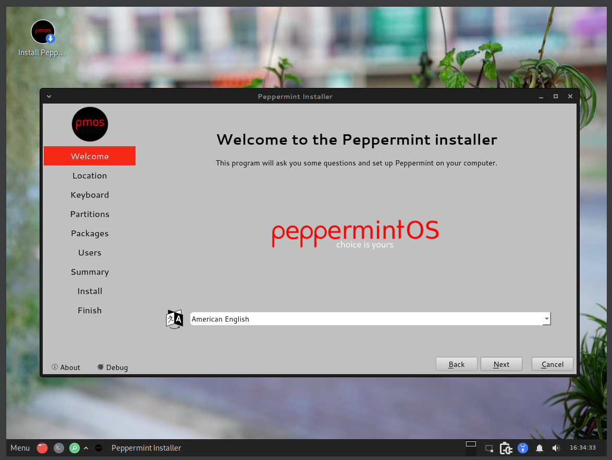
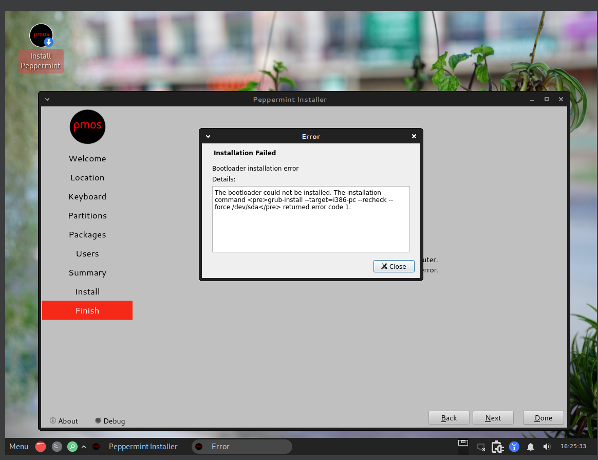

# Prueba ISO 03

## 1. Datos generales
- **Nombre de la ISO probada:**  Pepermint OS con Devuan (Debian sin sistemd, por variar)
- **Fecha:**  12 de abril, 2026
- **Software de virtualización:**  VirtualBox

## 2. Configuración de la VM
- **CPU asignada:**  2
- **RAM asignada:**  2 GB
- **Disco virtual:**  16 GB
- **Tipo de arranque configurado:**  BIOS Legacy
- **Otras opciones relevantes:**  Controlador USB 2.0, SIN aceleración de gráficos
## 3. Resultado del arranque
La iso arranca como cualquier otra distro liviana, desde un liveCD con algunas funcionalidades para usar sin necesidad de instalarlo en un disco. Hay un unico icono en el escritorio para instalarlo.

## 4. Resultado del instalador
El instalador me pedía 1GB de RAM minimo para funcionar. Aunque ya tenia 1024MB, he puesto otro giga más (igual que si añadiese otro slot). Por todo lo demás, al abrir el icono de install Pepermint, aparece una ventana para instalarlo, solo hay que seguir con las opciones de idiomas y hora. Este instalador tambien te deja gestionar las particiones y la swap del sistema. Este SO tarda bastante más que los anteriores.

## 5. Resultado final
Tras 3 intentos, teniendo la misma configuración que en las otras distros, el sistema operativo da error al instalarse. Es un error debootloader. Es posible que en una maquina real no se de. No he podido instalarlo en mi maquina virtual, pero el proceso no debería de cambiar.

## 6. Capturas relacionadas

## 7. Valoración
Teniendo a los otros SOs, me quedaría con MX Linux o Puppy linux por lo que ofrecen cada uno. Puppy Linux siendo un SO muy ligero en un pendrive y el MX Linux siendo más bonito que las otras dos opciones, con herramientas y que tambien funciona en el USB.
