# ENTREGA ÚNICA · Reto 01

> [!IMPORTANT]
> Este documento reúne toda la información necesaria para exportar la entrega final a PDF.

---

## 1. Portada

**Alumno/a:**  Andrés T. López Muñoz
**Grupo:**  Grupo 2
**Curso:**  1º ASIR
**Fecha:**  07/04/25

---

> [!NOTE]
> En este reto se analiza un equipo real, se seleccionan 3 ISOs Linux adecuadas y se prueban las 3 en una máquina virtual antes de pasar al aula taller.

---

## 2. Introducción

En este reto se plantea una situación parecida a la de un taller técnico real: antes de instalar un sistema en un equipo antiguo, conviene preparar varias opciones y comprobarlas.

El equipo objetivo es un **HP Compaq dc7800**, un ordenador veterano que puede presentar limitaciones de hardware. Por ello, en lugar de apostar por una sola distribución, se seleccionan varias **ISOs Linux ligeras** y se validan previamente en una **máquina virtual**.

La idea es parecida a llevar tres llaves para una cerradura vieja: puede que la primera abra a la primera, puede que otra se atasque, y puede que una tercera sea la que finalmente permita trabajar sin problemas. Por eso en este reto se eligen **tres candidatas**, se comparan y se prueban.

Los objetivos concretos son:

- analizar el hardware del equipo real;
- seleccionar tres distribuciones Linux razonables;
- justificar técnicamente cada elección;
- probar las tres en una VM;
- documentar resultados con capturas;
- decidir un orden de instalación para el aula taller.

---

## 3. Análisis del equipo real

# Datos del HP Compaq dc7800

## 1. Identificación del equipo
- **Marca y modelo:** HP Compaq dc7800
- **Número o variante del equipo (si aparece):**  SFF
- **Ubicación o identificación en el aula:**  Nº 2

## 2. Procesador
- **Modelo de CPU:**  Intel Core 2 Duo CPU E6750
- **Número de núcleos (si se conoce):**  2
- **Arquitectura observada o probable:**  64 bits

## 3. Memoria RAM
- **Cantidad total instalada:**  1GB
- **Tipo de memoria (si se conoce):**  DDR2 @ 667MHz

## 4. Almacenamiento
- **Tipo de unidad (HDD/SSD):**  HDD
- **Capacidad:** -
- **Observaciones:**  No tiene, pero lo normal seria que usase un HDD

## 5. Arranque y firmware
- **¿Se ha observado BIOS o UEFI?:**  BIOS
- **Observaciones del menú de arranque:**  Muestra un error en la pila CMOS, pero la BIOS se inicia y muestra algunas características
- **Comentarios sobre el particionado previsto:**  No hay particionado porque no hay un SO instalado, pero para este caso se le añadirian las particiones normales de un disco GPT, sin ninguna especifica.

## 6. Puertos y conectividad
- **USB disponibles:**  6 en la placa y 2 delante
- **Red:**  RJ45
- **Otros datos relevantes:**  Tiene disquetera, una tarjeta de red Wireless, conectores PSX y VGA.

## 7. Valoración inicial
Es un ordenador con características de componentes de bajo rendimiento y algún componente obsoleto. Tras añadir un disco de almacenamiento para permitir poder instalar un SO, se le instalará alguna ISO ligera con un entorno gráfico minimalista, como XFCE. Se pueden probar varias con un USB con Ventoy, así se puede ver como instalar distintos SO.

#### Imagen del ordenador:
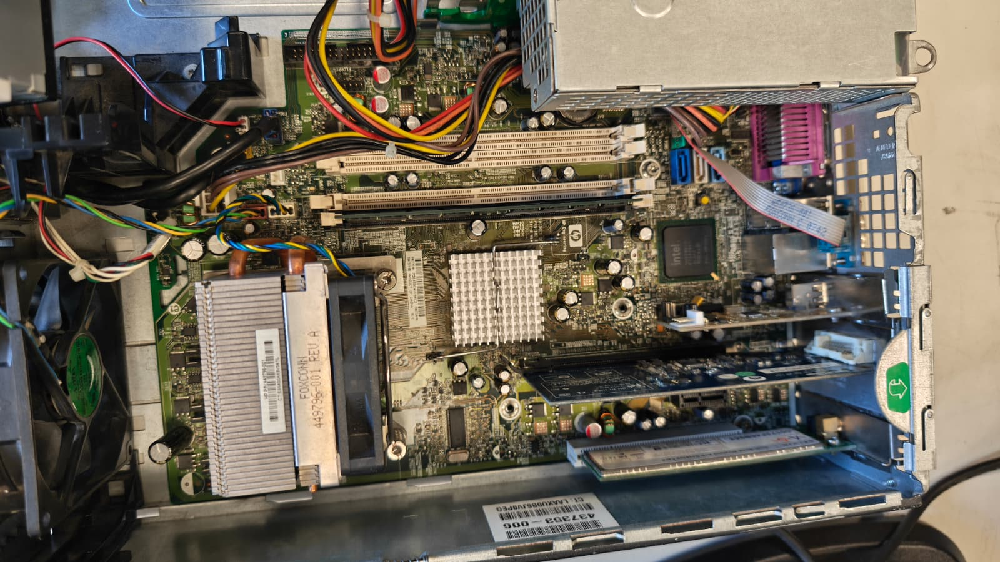

---

## 4. Selección de las 3 ISOs

### 4.1 Criterios usados
He buscado las ISOs de sistemas operativos que sean para ordenadores muy bajos recursos, que consuman poco y ocupen poco. Además es importante para al usarlos en el taller, que no requieran conexión a internet.

### 4.2 Tabla comparativa

| ISO    | Versión       | Arquitectura  | RAM mínima | Disco mínimo | Tamaño ISO | Ventajas                              | Inconvenientes                                 | Decisión       |
| ------ | ------------- | ------------- | ---------- | ------------ | ---------- | ------------------------------------- | ---------------------------------------------- | -------------- |
| ISO 01 | MX Linux 23.2 | 64bit y 32bit | 1 GB       | 15 GB        | 2.61GB     | Completo, usable y con MXTools        | Es el que mas ocupa                            | Segunda opción |
| ISO 02 | Peppermint OS | 64bit y 32bit | 1 GB       | 10 GB        | 1.47 GB    | Ligero y con integración en la nube   | Necesita internet, el resto no                 | Respaldo       |
| ISO 03 | Puppy Linux   | 64bit y 32bit | 300 MB     | 1-2 GB       | 791 MB     | Muy ligero, sin necesidad de instalar | Poco convencional, necesitas guardar la sesion | Primera opcion |

## Resumen de la comparación
La mejor opción y la más completa para las limitaciones que tenemos es MX Linux. Sin embargo, para el ordenador del taller, ajustándonos a los requisitos de clase, que son que no necesite internet y que no se necesite instalar y sea MUY MUY liviano, la opcion es Puppy Linux. Ya que para MX Linux necesitamos instalarlo en un disco de almacenamiento, cosa que nuestro PC no tiene y para sacarle partido a Peppermint tambien necesita almacenamiento e internet. Aunque tambien se puede usar sin internet, pero perdiendo su principal caracteristica.

---

### 4.3 Ficha resumida de ISO 01
- Distribución: Puppy Linux
- Versión: BookwormPup64 10.0.8 (basado en Debian)
- Motivo de elección: Es un sistema operativo ligero que puede funcionar directamente desde la RAM o un USB, sin necesitar una conexión a internet. Su entorno de escritorio consume muy poco. Lo malo es su estructura rara para usuarios estándar, ya que utiliza paquetes .sfs y requiere guardar la sesión manualmente al apagar.
- Papel dentro del plan: Principal

### 4.3.1 Ficha COMPLETA ISO 01
# ISO 01

## 1. Identificación
- **Nombre de la distribución:**  Puppy Linux
- **Versión:**  BookwormPup64 10.0.8 (basado en Debian)
- **Edición o sabor:**  BookwormPup (Debian)
- **Arquitectura:**  64bit y 32bit
- **Enlace oficial de descarga:**  https://forum.puppylinux.com/puppy-linux-collection

## 2. Requisitos y características
- **RAM mínima indicada por la fuente:**  300MB, pero el minimo para un buen funcionamiento es entre 512MB y 1GB
- **Espacio en disco mínimo:**  Puede usarse desde de la RAM, pero recomiendan 1 a 2 GB para el guardado de la sesion
- **Tipo de entorno de escritorio:**  JWM / ROX-Filer
- **Tamaño aproximado de la ISO:**  791MB en la que he descargado.

## 3. Motivos de selección
Es un SO muy muy ligero, funciona desde la RAM, desde el USB y tiene un entorno de escritorio bastante más liviano que XFCE, que ya de por si es bastante ligero. Debido a que en la ISO viene todo lo necesario para funcionar, no es ni siquiera necesario conectarlo a internet para descargar el resto del sistema operativo. Además, tiene un nombre y una mascota graciosa, que no es importante para su funcionamiento pero llama la atención.

## 4. Posibles riesgos o dudas
No es como un SO Linux casual, su estructura es muy distinta a la de los sistemas Linux normales. Los programas se instalan desde paquetes .sfs y necesitas guardar la sesión cuando apagas el ordenador. Esto para un usuario acostumbrado a otros SO puede ser raro.

## 5. Papel dentro del plan
- [x] Opción principal
- [ ] Alternativa
- [ ] Respaldo

## 6. Fuente consultada
- **Web o documentación oficial:**  https://puppylinux-woof-ce.github.io/

---

### 4.4 Ficha resumida de ISO 02
- Distribución: MX Linux
- Versión: 23.2 "Libretto"
- Motivo de elección: Es liviano por su entorno XFCE liviano y buena opcion por incluir las MX Tools. Es una ISO un poco más pesada y requiere instalación en un almacenamiento interno para guardar cambios.
- Papel dentro del plan: Alternativa

### 4.4.1 Ficha COMPLETA de ISO 02
# ISO 02

## 1. Identificación
- **Nombre de la distribución:**  MX Linux
- **Versión:**  23.2 "Libretto"
- **Edición o sabor:**  XFCE, no viene de una edición de otro SO como debian.
- **Arquitectura:**  64bit y 32bit
- **Enlace oficial de descarga:**  https://mxlinux.org/download-links/

## 2. Requisitos y características
- **RAM mínima indicada por la fuente:**  1GB
- **Espacio en disco mínimo:**  15 GB
- **Tipo de entorno de escritorio:**  XFCE
- **Tamaño aproximado de la ISO:**  2,61GB

## 3. Motivos de selección
Al ser XFCE, su entorno es bastante liviano. No es la principal opción porque ocupa bastante más. Pero a consecuencia de eso viene más completo. Lo mejor es que viene con MX Tools, que son utilidades para PCs de bajos recursos o antiguos, con drivers, códecs, etc.

## 4. Posibles riesgos o dudas
Puede que en el ordenador no funcione tan bien, aunque sigue siendo funcional por lo liviano que es. Tambien hace falta un almacenamiento interno, ya que, a diferencia de Puppy Linux, hace falta instalarlo si se quieren guardar las cosas.
## 5. Papel dentro del plan
- [ ] Opción principal
- [x] Alternativa
- [ ] Respaldo

## 6. Fuente consultada
- **Web o documentación oficial:**  https://mxlinux.org/

---

### 4.5 Ficha resumida de ISO 03
- Distribución: Peppermint OS
- Versión: Devuan Daedalus
- Motivo de elección: Es más ligera que MX Linux y destaca por su herramienta Kumo, que permite usar aplicaciones web como nativas. Se ha elegido la base Devuan para no usar de systemd y tener un poco más de variedad. Lo malo es que depende de una buena conexión a internet para aprovechar lo de la nube y dio errores de bootloader durante las pruebas en la máquina virtual.
- Papel dentro del plan: Respaldo

### 4.5.1 Ficha COMPLETA ISO 03

# ISO 03

## 1. Identificación
- **Nombre de la distribución:**  Peppermint OS
- **Versión:**  Devuan Daedalus
- **Edición o sabor:**  Devuan Base
- **Arquitectura:**  64bit y 32bit
- **Enlace oficial de descarga:**  https://peppermintos.com/download-and-install/

## 2. Requisitos y características
- **RAM mínima indicada por la fuente:**  1GB
- **Espacio en disco mínimo:**  10GB
- **Tipo de entorno de escritorio:**  XFCE
- **Tamaño aproximado de la ISO:**  1,47GB

## 3. Motivos de selección
Es un poco más liviana que MX Linux. Está basado en Debian. Aunque no tiene las MXTools de MX Linux, tiene integración con la nube, que con acceso a internet se pueden acceder a muchos programas. Ya que con Kumo, una herramienta propia, crea Site Specific Browsers, lo que permite ejecutar aplicaciones web como aplicaciones nativas, ahorrando recursos en el uso de software. He elegido Devuan por escoger una versión más antigua, ya que no está el Debian Bookworm para descargar, esto es por variar un poco en la selección ya que no tiene sistemd.

## 4. Posibles riesgos o dudas
Requiere una buena conexión a internet para las herramientas en la nube. En la MV me ha dado errores por el bootloader, puede que en baremetal se solucione.

## 5. Papel dentro del plan
- [ ] Opción principal
- [ ] Alternativa
- [x] Respaldo

## 6. Fuente consultada
- **Web o documentación oficial:**  https://peppermintos.com/

---

## 5. Configuración de la máquina virtual

# Configuración de la máquina virtual

## Software utilizado
- **Aplicación:**  Oracle VM VirtualBox
- **Versión:**  7.2.6

## Configuración aplicada
- **CPU:**  2
- **RAM:**  1GB
- **Disco virtual:**  16
- **Controlador de almacenamiento:**  SATA
- **Red:** No, para comprobar la instalación desatendida  
- **Audio / vídeo / otros ajustes relevantes:**  Por defecto

## Relación con el equipo real
La CPU al ser un Intel Core 2 Duo, con dos núcleos, se le ha especificado a la maquina virtual dichos dos núcleos para simularlo de la manera más parecida posible.
El ordenador del taller contaba con un único modulo de 1GB de RAM, y eso es lo que he le he puesto, 1024MB. Aunque la velocidad de la RAM es distinta, en el ordenador del taller es DDR2, siendo bastante más lenta que en la maquina virtual.

Los periféricos no pueden ser simulados con una maquina virtual, ya que obviamente depende de que modelo de teclado y raton tienen, pero eso no es muy importante respecto al rendimiento.
Sin embargo la placa base y chipset tampoco se pueden simular y son fundamentales en como el ordenador detecta a los componentes y por ende, su rendimiento. Tampoco el controlador gráfico, ya que se esta usando el que tiene VirtualBox por defecto. Igual que los periféricos mencionados anteriormente, tampco se puede recrear el rendimiento de estos o de dispositivos integrados como USBs o dispositivos de voz y audio.
## Observación importante
La máquina virtual sirve como **banco de pruebas previo**, pero no garantiza al 100 % el mismo comportamiento que el equipo real.
Puede que algún driver en la maquina virtual ya venga configurado pero sin embargo en el ordenador real falle por cualquier motivo.
La BIOS del ordenador no se sabe si puede fallar alguna configuración en el ordenador real, ya que recrear eso en la MV es dificil.
La velocidad de arranque puede que sea bastante más lenta o la velocidad del USB puede resultar afectada por tener algo roto.
Al propio ordenador le faltan componentes como el disco duro, por tanto puede faltar cualquier otra cosa más pequeña dentro de la placa o directamente hacer conflicto con otro componente.

En general, es más facil hacer que funcionen las ISOs en una MV, ya que la máquina real puede tener problemas en el momento de usarlo o fallar en cualquier proceso del uso de dichas ISOs debido al desconocimiento de sus características.

---

## 6. Resultados de las pruebas

### 6.1 ISO 01
- ¿Arranca?: Sí
- ¿Entra al instalador?: Sí
- ¿Se instala?: Sí
- ¿Arranca después?: Sí
- Incidencias: No
- Capturas:
# Prueba ISO 01

## 1. Datos generales
- **Nombre de la ISO probada:**  Puppy Linux, Bookworm
- **Fecha:**  12 de abril, 2026
- **Software de virtualización:**  VirtualBox

## 2. Configuración de la VM
- **CPU asignada:**  2
- **RAM asignada:**  1 GB
- **Disco virtual:**  16 GB
- **Tipo de arranque configurado:**  BIOS Legacy
- **Otras opciones relevantes:**  Controlador USB 2.0, SIN aceleración de gráficos

## 3. Resultado del arranque
El sistema se ha iniciado sin problema, mostrando diferentes opciones en el GRUB de la ISO, pudiendo seleccionar la más adecuada para lo que lo queremos usar. En este caso es la primera opcion. Tras eso, inicia el entorno grafico y una ventana de setup para poner el idioma y la hora. Con esto el sistema está listo para usar, y cualquier cosa que guardemos se guardará en el USB. A la hora de apagar, para que se guarde todo, hay que guardar la sesión.

## 4. Resultado del instalador
Aunque este sistema se usa desde un USB, se puede instalar.
En mi caso estoy en la versión Bookworm de Debian, y el proceso cambia respecto a otras versiones más modernas y antiguas. Hay que ir al a la opcion de instalar en la parte de setup dentro del menú, crear las particiones con Gparted (una de /boot en FAT32 y otra de / en ext4). Luego instalar los archivos de puppy en dicha opción, usando de fuente los archivos actuales del sistema, y por ultimo instalar el boot en la parte de boot en la partición FAT32. No es un proceso dificil pero hay que tener ciertos conocimientos. Despues guardar en la partición con la / en ext4 y reiniciar, quitando el USB.
## 5. Resultado final
Tras iniciarse se puede ver que el disco USB no se ve abajo a la derecha y sale el disco principal. Tambien se puede ver el almacenamiento en el visor de recursos de la derecha. Al abrir las particiones se puede ver la jerarquía de directorios común en boot y en la raíz.

## 6. Capturas relacionadas
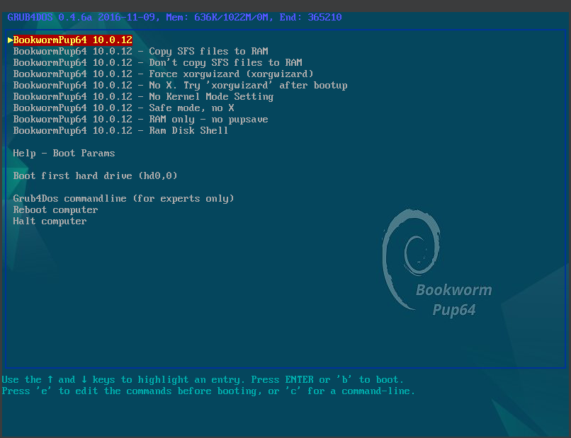
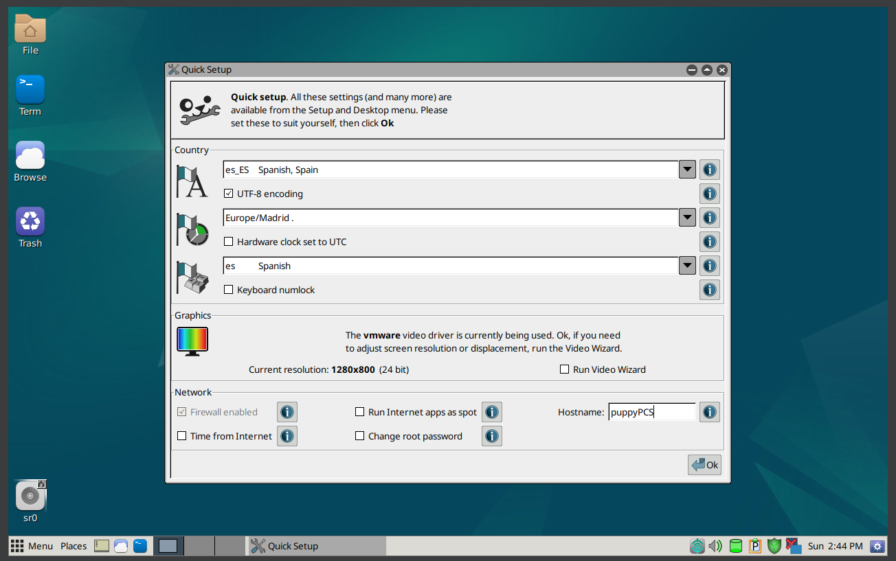
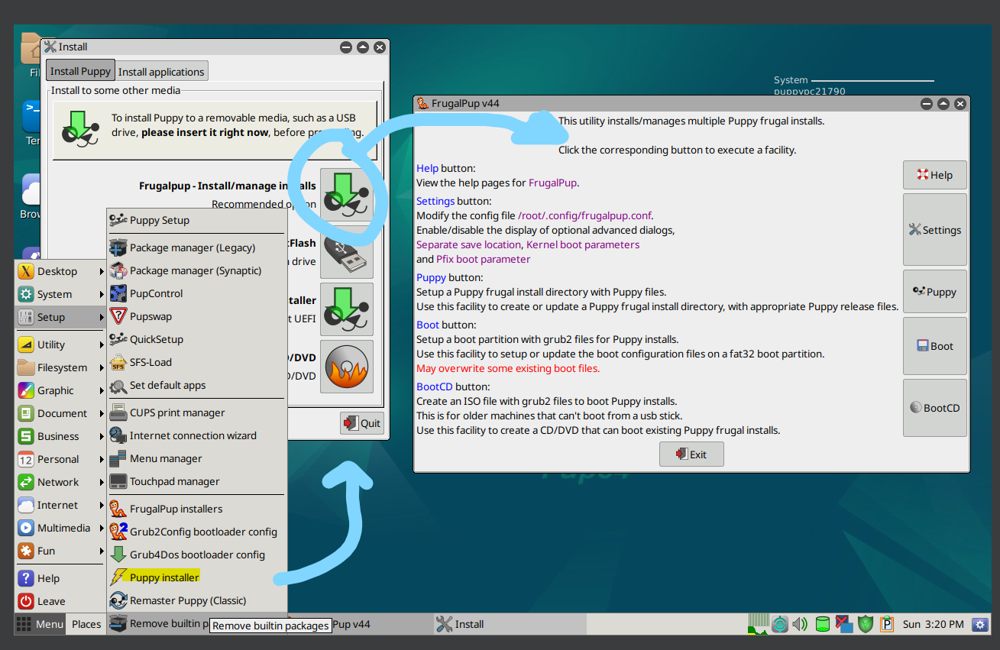
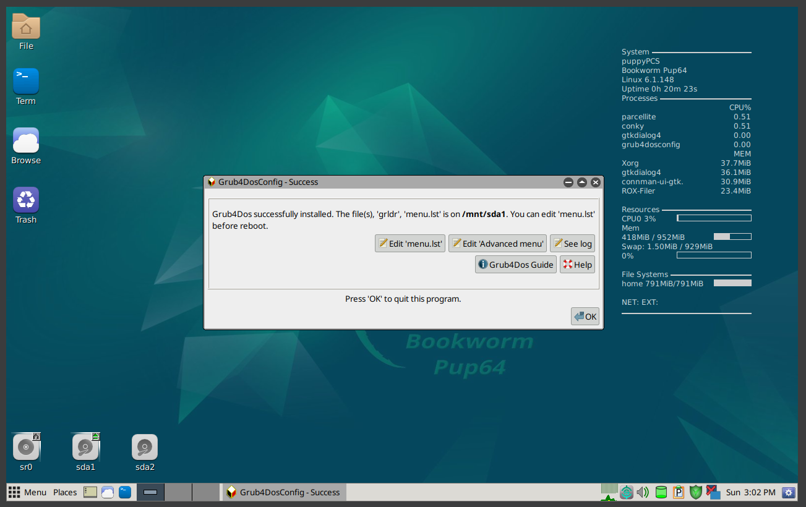
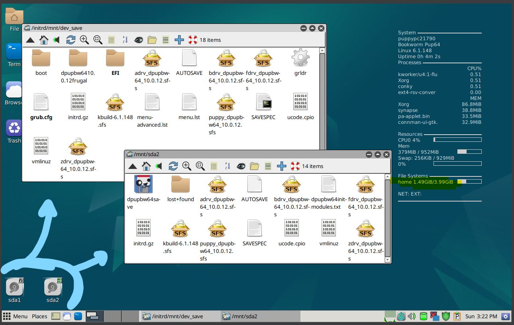

## 7. Valoración
Es la principal y  mejor opción para este ordenador del taller. Porque no hace falta disco duro y porque es de los que menos consume, sin perder funcionalidades. Quitando el inconveniente de guardar cada vez que apagas. Es muy buena opción.

---

### 6.2 ISO 02
- ¿Arranca?: Sí
- ¿Entra al instalador?: Sí
- ¿Se instala?: Sí
- ¿Arranca después?: Sí
- Incidencias: No
- Capturas:
# Prueba ISO 02

## 1. Datos generales
- **Nombre de la ISO probada:**  MX Linux
- **Fecha:**  12 de abril, 2026
- **Software de virtualización:**  VirtualBox

## 2. Configuración de la VM
- **CPU asignada:**  2
- **RAM asignada:**  1 GB
- **Disco virtual:**  16 GB
- **Tipo de arranque configurado:**  BIOS Legacy
- **Otras opciones relevantes:**  Controlador USB 2.0, SIN aceleración de gráficos

## 3. Resultado del arranque
Se ha iniciado el GRUB de la ISO como cualquier ISO, y ha entrado al sistema operativo. Tras eso automáticamente hay una ventana inicial con configuraciones y el instalador. El sistema se puede usar tal cual asi.

## 4. Resultado del instalador
En la ventana inicial, seleccionando la opción del instalador te deja instalarlo sin necesidad de conectarse a internet. A partir de ahi es bastante sencillo, solo hay que continuar con las opciones correspondiente. Si se desea hacer particiones en este mismo paso te da la posibilidad.

## 5. Resultado final
Con todo esto y reiniciando, el sistema ya queda instalado. Es bastante rapido ya que ocupa poco. Solo con un 1GB de RAM funciona. Tambien se crea un usuario en la instalación con posibilidad de crear uno para root tambien.

## 6. Capturas relacionadas
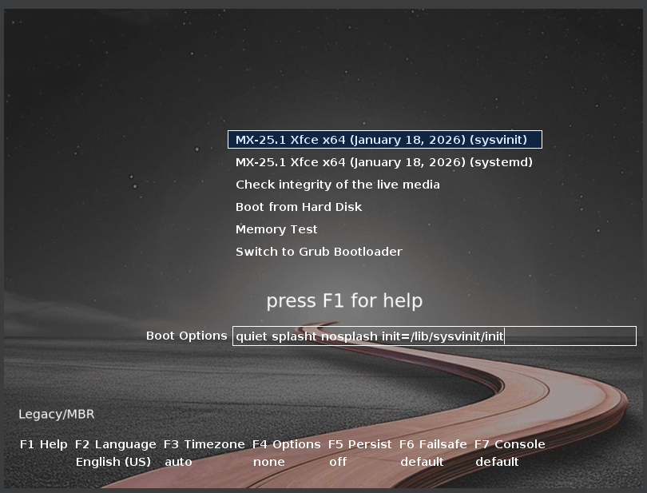
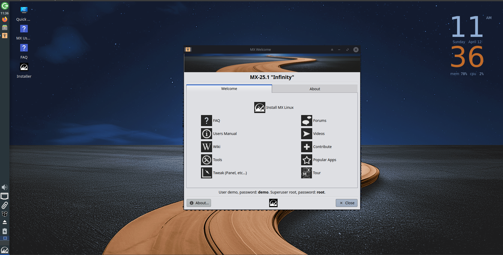
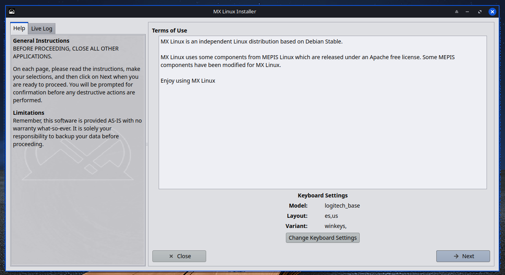
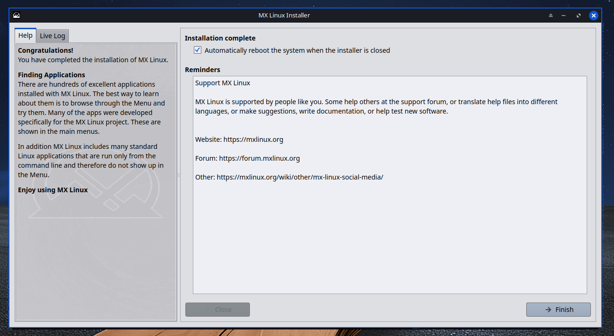
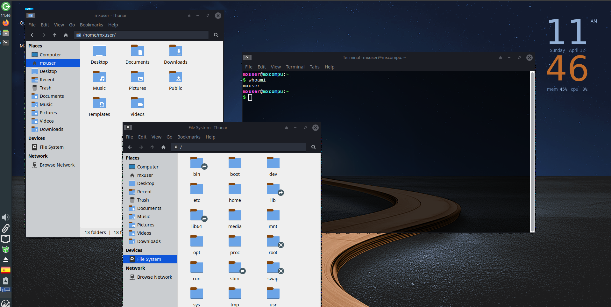

## 7. Valoración
Esta es tambien una muy buena opcion por lo rapido que es, aunque no es tan liviano como otros es bastante liviano. Es más bonito que Puppy, cuenta con transparencias y  un reloj arriba a la derecha. Tambien cuanta con herramientas extra y muchas funcionalidades. Funciona en liveCD al igual que Puppy, pero no se guarda igual.

---

### 6.3 ISO 03
- ¿Arranca?: Sí
- ¿Entra al instalador?: Sí
- ¿Se instala?: No
- ¿Arranca después?: Sí
- Incidencias: Bootlader
- Capturas:
# Prueba ISO 03

## 1. Datos generales
- **Nombre de la ISO probada:**  Pepermint OS con Devuan (Debian sin sistemd, por variar)
- **Fecha:**  12 de abril, 2026
- **Software de virtualización:**  VirtualBox

## 2. Configuración de la VM
- **CPU asignada:**  2
- **RAM asignada:**  2 GB
- **Disco virtual:**  16 GB
- **Tipo de arranque configurado:**  BIOS Legacy
- **Otras opciones relevantes:**  Controlador USB 2.0, SIN aceleración de gráficos
## 3. Resultado del arranque
La iso arranca como cualquier otra distro liviana, desde un liveCD con algunas funcionalidades para usar sin necesidad de instalarlo en un disco. Hay un unico icono en el escritorio para instalarlo.

## 4. Resultado del instalador
El instalador me pedía 1GB de RAM minimo para funcionar. Aunque ya tenia 1024MB, he puesto otro giga más (igual que si añadiese otro slot). Por todo lo demás, al abrir el icono de install Pepermint, aparece una ventana para instalarlo, solo hay que seguir con las opciones de idiomas y hora. Este instalador tambien te deja gestionar las particiones y la swap del sistema. Este SO tarda bastante más que los anteriores.

## 5. Resultado final
Tras 3 intentos, teniendo la misma configuración que en las otras distros, el sistema operativo da error al instalarse. Es un error debootloader. Es posible que en una maquina real no se de. No he podido instalarlo en mi maquina virtual, pero el proceso no debería de cambiar.

## 6. Capturas relacionadas

## 7. Valoración
Teniendo a los otros SOs, me quedaría con MX Linux o Puppy linux por lo que ofrecen cada uno. Puppy Linux siendo un SO muy ligero en un pendrive y el MX Linux siendo más bonito que las otras dos opciones, con herramientas y que tambien funciona en el USB.

---

## 7. Conclusión final

# Conclusión final y plan de instalación

## 1. Resumen del análisis
Tras comprar las 3 ISOs, la mejor para el ordenador del taller es Puppy Linux porque se puede usar sin instalar. Es muy ligera y usa muy poca RAM. En las pruebas ha funcionado bastante bien. Pero si hay que elegir una para instalar, la ISO candidata perfecta es MX Linux, ya que ocupa poco y funciona bastante bien, sin perder estética. Incluye también una serie de herramientas muy útiles para un PC de estas características, como el que nos podemos encontrar en el taller. Con soporte de drivers y otras herramientas. La tercera opción de respaldo es funcional sobre el papel, su instalador es sencillo, pero en mi caso, me da error. Tambien se tiene que instalar, pero es un poco más ligero que MX Linux. Las tres se instalan sin internet, por tanto no dependemos de una conexión por cable para la práctica en el taller.

## 2. Decisión final
- **ISO elegida como opción principal:**  Puppy Linux
- **ISO elegida como alternativa:**  MX Linux
- **ISO elegida como respaldo:**  Peppermint OS

## 3. Justificación de la decisión
La opción principal es ideal porque no se tiene que instalar, la segunda que es la alternativa, ya necesita un disco duro pero es bastante ligera, por si se complica el uso con Puppy Linux. La de respaldo es algo un poco más distinta, pero es igual de funcional que las otras. Si con MX Linux el ordenador se queda corto de espacio, Peppermint OS lo puede solucionar.

## 4. Plan para el aula taller
Si al Puppy no le funciona la instalación o queremos simplificar las cosas tenemos la alternativa que es MX. Si MX consume mucho por su estética o por su tamaño, Peppermint es una opción parecida pero más liviana.

## 5. Aprendizaje obtenido
He aprendido sobre distros ligeras y como instalarlas. Sobretodo a usar Puppy Linux y su forma de funcionar con "guardar estado" y su instalación, que no la he visto en ningún otro sitio. Por todo lo demás, no se diferencia con una instalación de Ubuntu o Mint. Y la MV al ser sencilla y funcionar con sistemas operativos que pesan muy poco, no me ha complicado. Tambien he aprendido sobre el error de bootloader de Peppermint, aunque no lo haya podido solucionar del todo.

---

## 8. Bibliografía

-  [Recomendación de PCcomponentes sobre distros ligeras](https://www.pccomponentes.com/distribuciones-linux-ligeras-para-ordenadores-antiguos?srsltid=AfmBOoqxJ8ms8CCS0x1t9KrSprgNWeveAdzZTivUjUiE9-SIl2rRAW24)
-  [SoloLinux recomendación](https://sololinux.es/distribuciones-linux-ligeras/)
-  [Instalación puppy linux](https://es.wikihow.com/instalar-Puppy-Linux)
- [Web oficial Puppy Linux](https://puppylinux-woof-ce.github.io/) 
- [Descarga Puppy Linux](https://forum.puppylinux.com/puppy-linux-collection)
- [Web oficial MX Linux](https://mxlinux.org/)
- [Descarga MX Linux](https://mxlinux.org/download-links/)
- [Web oficial Peppermint OS](https://peppermintos.com/)
- [Descarga Peppermint OS](https://peppermintos.com/choose-your-base/)
