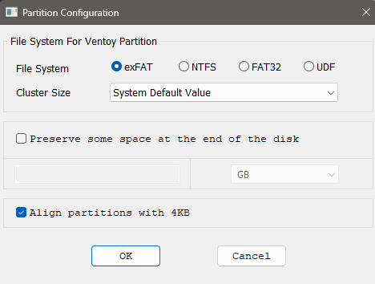

# Ficha · Preparación del USB con Ventoy

## 1. Datos básicos del pendrive
- Marca y modelo: Verbatim STORE N GO
- Capacidad: 32GB
- Sistema desde el que se preparó: Windows

## 2. Preparación de Ventoy
- Programa utilizado: Ventoy, claro, la versión normal
- Versión de Ventoy: 1.1.11
- Pasos seguidos para instalar Ventoy en el USB:
  1. Descargar el programa en .zip desde la web y desde sourceforge
  2. Abrir el archivo ejecutable de ventoy2Disk
  3. Elegir el USB correspondiente
  4. OPCIONAL: cambiar el sistema de ficheros por fat32, se puede dejar todo por defecto, pero no viene mal hacer este cambio.
  5. Instalarlo y formatear

## 3. Precauciones tomadas
- ¿Se comprobó que el USB correcto era el seleccionado?: Sí
- ¿Se hizo copia de seguridad de los datos del pendrive antes de formatearlo?: Sí
- ¿Se verificó que Ventoy quedó instalado correctamente?: Se verificó en el ordenador del taller

## 4. Evidencias
- Captura o foto del proceso de instalación de Ventoy: 

- Captura o foto del contenido del USB ya preparado: 

- Observaciones: Se crean 2 particiones en el USB, una con la UEFI y otra donde introducir las distros o temas para el grub del Ventoy. A esta ultima partición, desde Windows no me está dejando acceder, pero en el linux de clase por ejemplo, si se puede ver los archivos. Debe de ser por un error al guardar los archivos en la práctica.

## 5. Valoración
La instalación es muy sencilla, solo es asegurarse que USB quieres y solo darle al boton de instalar. Ya el resto solo metes las ISOs de manera normal. Se puede complicar más el proceso si quieres que sea discos GPT, o ponerles temas, o cambiarlo a FAT32. Sin embargo, para está práctica, no es realmente necesario, se puede dejar por defecto y solo añadir las ISOs.
