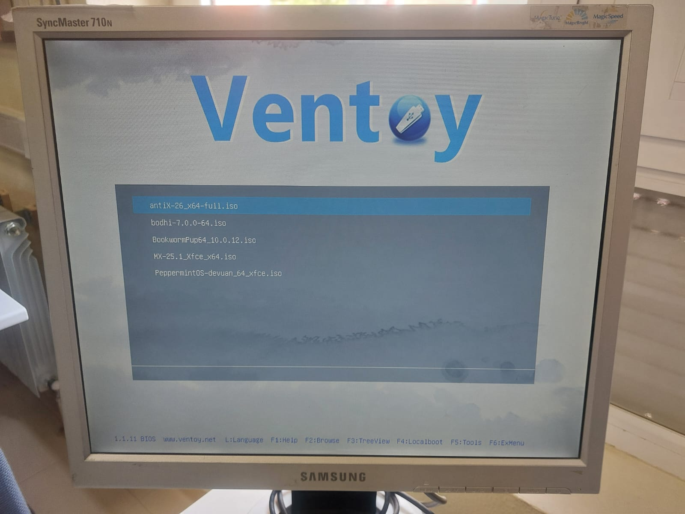

# Ficha · Registro general de la instalación

## 1. Datos de la sesión de trabajo
- Fecha: Viernes 17 a última hora (20:05-21:00), Martes 21 en las primeras dos horas (15:00-16:50)
- Aula o taller: Taller de informática del Carlos III
- Miembros del grupo: Ugo, Valentín, Natalia, yo
- Equipo utilizado: HP Compaq dc7800

## 2. Preparación previa
- ¿El USB con Ventoy estaba listo?: Sí, los 3
- ¿Estaban copiadas las 3 ISOs?: Sí
- ¿Se sabía el orden de intento?: Sí, y así se intentó

## 3. Arranque del equipo
- Tecla o método usado para seleccionar el arranque: F10 y F1
- ¿Entró correctamente en el menú de arranque? Sí
- ¿Se detectó el USB? Sí
- ¿Ventoy arrancó correctamente? El viernes sí, el martes con la RAM cambiada no arranca ventoy, en otro ordenador sí

## 4. Resultado global
- ISO finalmente instalada: Dos en dos PCs y el Puppy no hizo falta instalar
- ¿La instalación terminó correctamente?: No dio tiempo a terminar de intalar MX, pero sí
- ¿El sistema arranca después de instalar?: Sí
- Observaciones generales: Los ordenadores con estos sistemas operativos han sido usables cuando en un primer instante puedes dudar de su funcionamiento

## 5. Evidencias clave
- Foto o captura del menú de arranque: 
- Foto o captura del menú de Ventoy: 
- Foto o captura del sistema ya instalado:  
