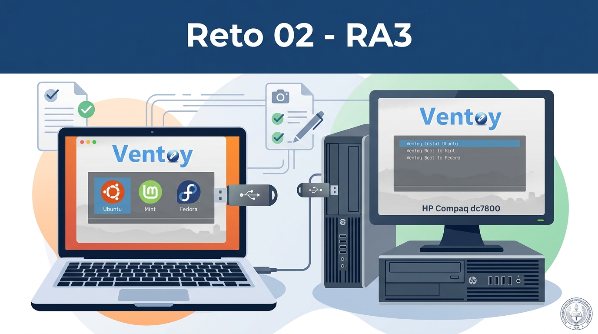
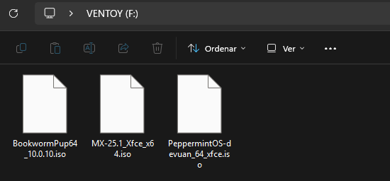
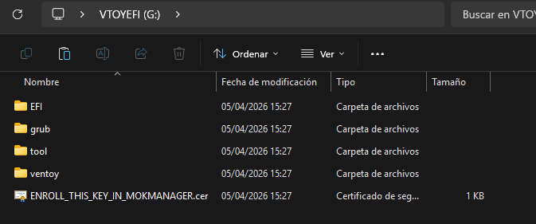
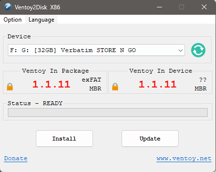
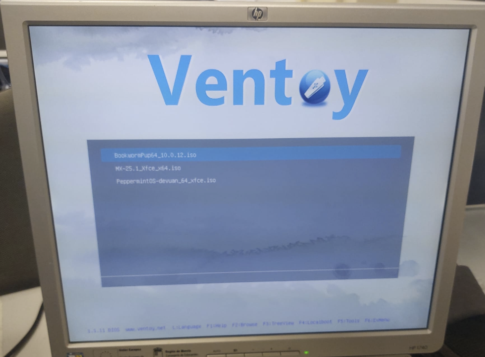
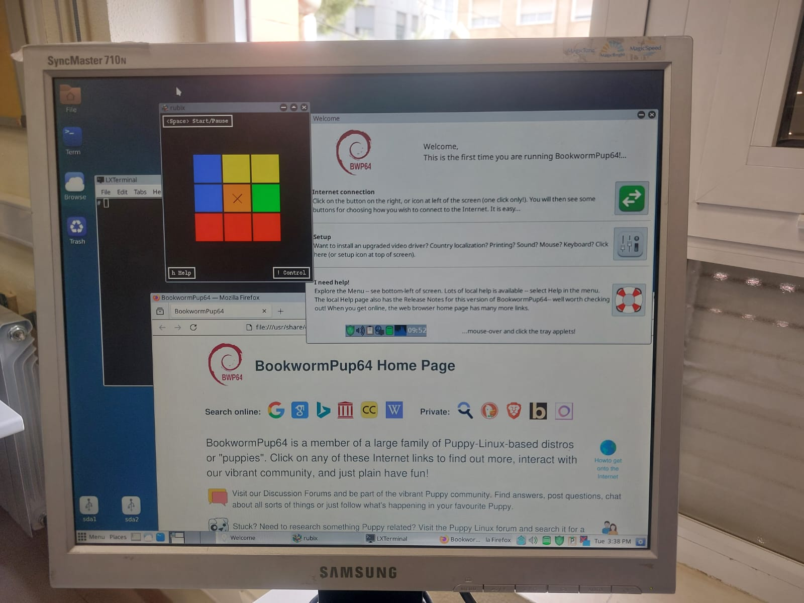
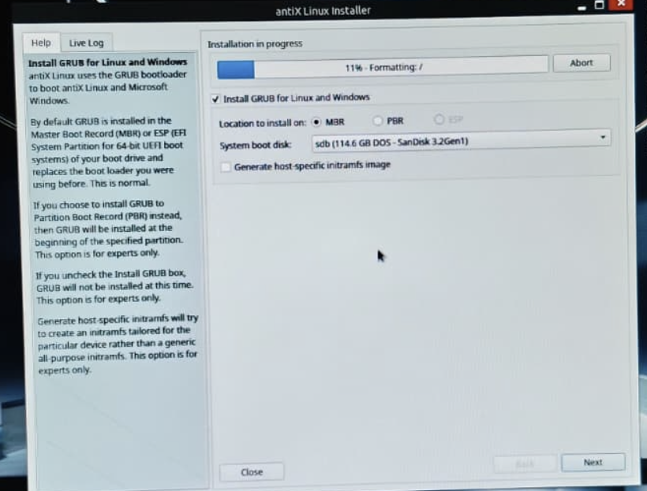
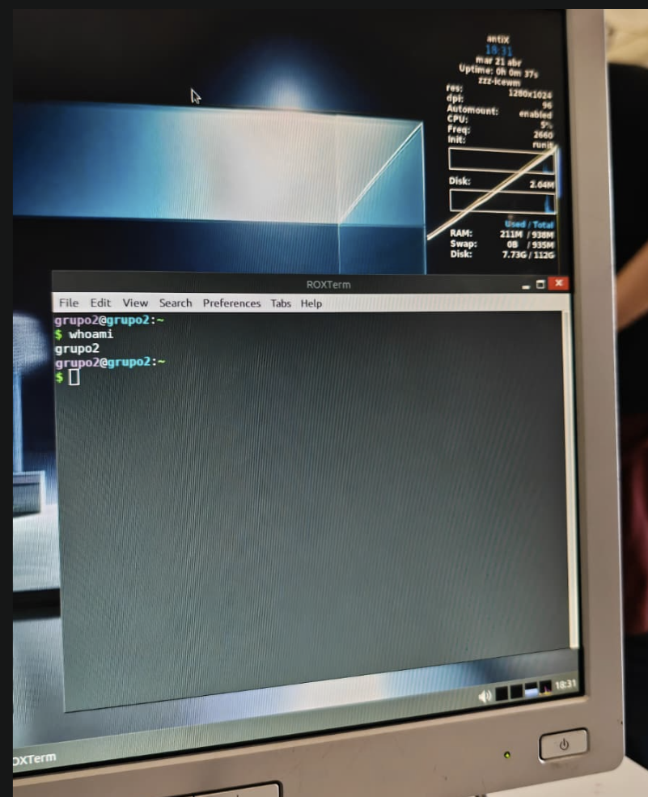
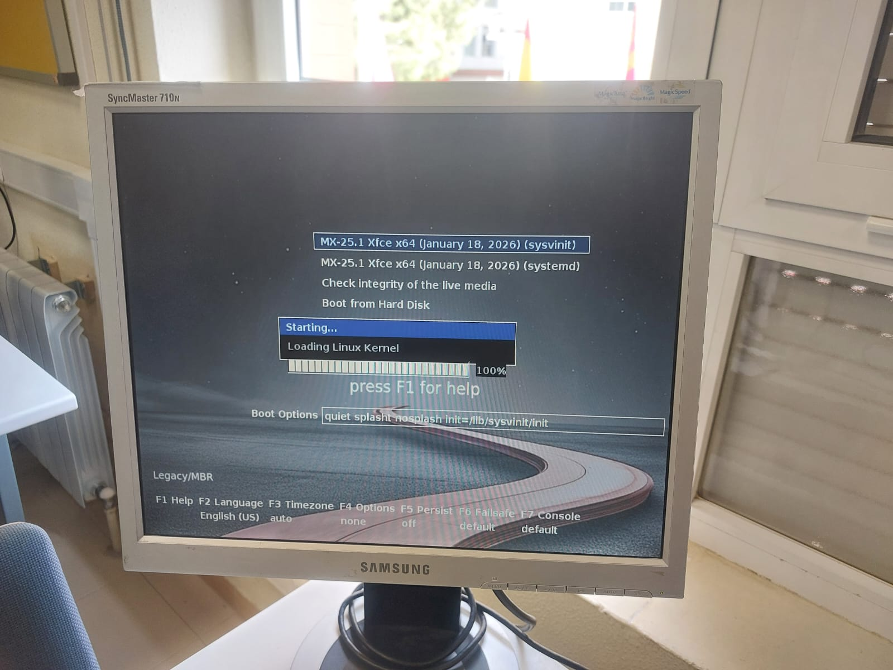
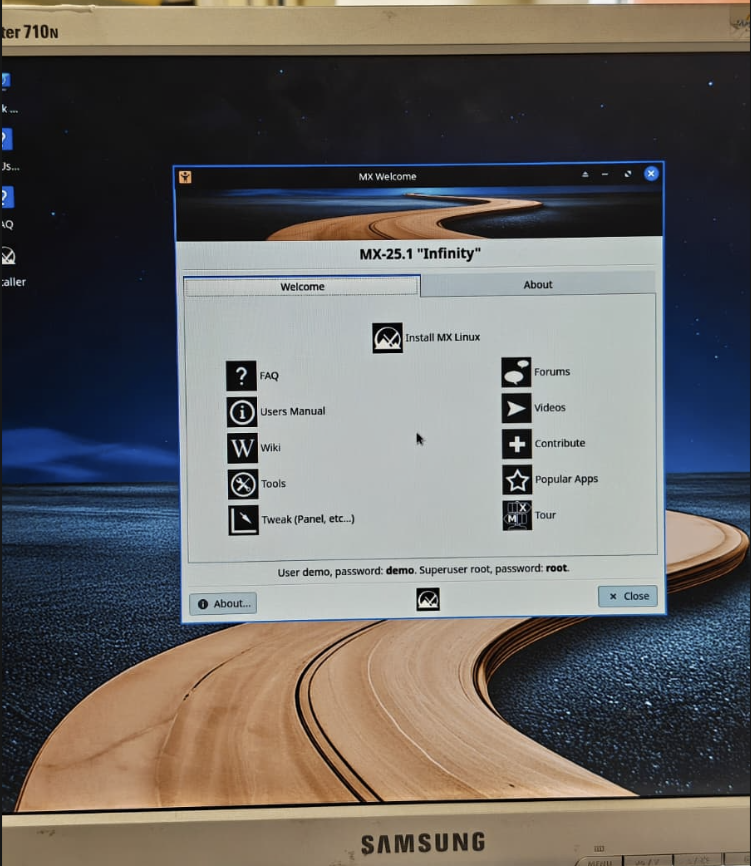

# ENTREGA ÚNICA · Reto 02

> Este documento reúne toda la información necesaria para exportar la entrega final a PDF.

---
## 1. Portada

# Proyecto de FHW · RA3 · UT5

## Reto 02
# Instalación de Linux en HP Compaq dc7800 mediante Ventoy

**Alumno/a:**  Andrés T. López Muñoz
**Grupo:**  2
**Curso:**  1º ASIR
**Fecha:**  21/04/26

> [!NOTE]
> En este reto se prepara un USB con Ventoy, se dejan cargadas las 3 ISOs seleccionadas en el Reto 01 y se instala al menos una de ellas en el equipo real HP Compaq dc7800, documentando todo el proceso.

---
## 2. Introducción

# Introducción

En este reto el objetivo es pasar de la preparación previa a la **instalación real** de una distribución Linux en el **HP Compaq dc7800**.

En el reto anterior se eligieron tres distribuciones y se probaron en una máquina virtual.  
Ahora toca trabajar con el equipo físico, utilizando **Ventoy** como medio de arranque para tener disponibles las tres ISOs en un único USB.

La idea es sencilla: llevar al aula taller una especie de **mochila técnica**.  
Si la primera ISO falla, ya tenemos una segunda y una tercera preparadas, sin tener que rehacer el USB desde cero.

Este documento debe dejar constancia de:
- cómo se preparó el USB con Ventoy,
- qué tres ISOs se copiaron,
- en qué orden se intentó la instalación,
- qué problemas aparecieron,
- qué soluciones se aplicaron,
- y qué sistema quedó finalmente instalado.

---
## 3. Preparación del USB con Ventoy

### 3.1 Datos del pendrive
- Marca y modelo: Verbatim STORE N GO
- Capacidad: 32GB

### 3.2 Preparación de Ventoy
- Programa utilizado: Ventoy, claro, la versión normal
- Versión de Ventoy: 1.1.11
- Pasos seguidos para instalar Ventoy en el USB:
  1. Descargar el programa en .zip desde la web y desde sourceforge
  2. Abrir el archivo ejecutable de ventoy2Disk
  3. Elegir el USB correspondiente
  4. OPCIONAL: cambiar el sistema de ficheros por fat32, se puede dejar todo por defecto, pero no viene mal hacer este cambio.
  5. Instalarlo y formatear

### 3.3 Relación de ISOs en el USB
- ISO 01: Puppy Linux
- ISO 02: MX Linux
- ISO 03: Peppermint OS

### 3.4 Evidencias
- Captura del contenido del USB: 
- 
- Captura del menú de Ventoy: 
- 
- 

---
## 4. Plan de instalación

### 4.1 Orden previsto de intento
1. **Primera opción:** Puppy Linux
   - Motivo: Funciona en la RAM y es muy ligera, no hace falta instalarla para usarla por completo.
1. **Segunda opción:** MX Linux
   - Motivo: Sistema operativo muy ligero y con una mejor estetica.
1. **Tercera opción:** Peppermint OS
   - Motivo: Opción ligera como ultimo recurso. Es un Debian más ligero al fin y al cabo.

Ya que los ordenadores no tienen unas características muy buenas, se tienen que elegir ISOs muy ligeras, con entornos gráficos limitados y simples pero con todas las funcionalidades que se requieran, son sistemas operativos usables como cualquiera al fin y al cabo. Las tres funcionan sin Internet y pesan poco. Y además funcionan en live CD, osea que se pueden usar sin instalar. Puppy Linux destaca sobretodo con eso.

### 4.2 Criterios para cambiar de ISO
Indica cuándo decidiréis pasar de una ISO a la siguiente.  
Ejemplos:
- no arranca,
- se bloquea el instalador,
- no detecta bien el disco,
- la instalación falla repetidamente,
- el sistema no arranca tras instalarse.
- 
- El ordenador va más lento,
- se pierden funcionalidades,
- tienen limitaciones en los drivers,
- hay cosas y servicios que no cargan.

---
## 5. Desarrollo de la instalación en el HP Compaq dc7800

### 5.1 Arranque desde USB
- Tecla o método usado para seleccionar el arranque: F10 y F1
- ¿Entró correctamente en el menú de arranque? Sí
- ¿Se detectó el USB? Sí
- ¿Ventoy arrancó correctamente? El viernes sí, el martes con la RAM cambiada no arranca ventoy, en otro ordenador sí

### 5.2 Intento con ISO 01
# Ficha · Intento de instalación 1

## 1. Datos básicos
- ISO utilizada: Puppy Linux
- Fecha y hora aproximada: Viernes 17 a última hora (20:05-21:00)
- Puesto dentro del plan: principal

## 2. Arranque
- ¿Se seleccionó la ISO desde Ventoy?: Sí
- ¿La ISO arrancó correctamente?: Sí
- Evidencia: 
- 
## 3. Instalación
- ¿Se llegó al instalador?: Sí, se puede llegar, pero no fue necesario.
  
- Tipo de instalación elegido: Ninguna, es un sistema operativo que se caracteriza por no necesitar que se instale, y como en ese momento nuestro PC no tenia disco duro, no lo instalamos. Pero en caso de instalarlo en una instalación manual.
 
- Esquema de particionado usado: No usamos, pero en caso de usarlas hay que crear una de /boot en FAT23 y otra de la partición raíz en ext4. La partición raiz contiene copiada la informacion del usb, tal cual se copia y pega, y el boot lo instala el propio instalador.
  
- Pasos principales realizados(TODOS LOS RELEVANTES):
  1. Abrir instalador
  2. Crear particiones
  3. Darles formato
  4. Instalar desde el USB
  5. Reiniciar

## 4. Resultado del intento
- ¿La instalación finalizó correctamente?: Se pudo usar sin instalar correctamente
- ¿El sistema arrancó después?: Sí
- Estado final: éxito

## 5. Problemas encontrados
- Problema 1: No teníamos la hora correcta, ya que la pila CMOS estaba gastada
- Problema 2: No teníamos disco duro
- Problema 3: La pantalla no podía ser conectada por VGA

## 6. Soluciones aplicadas
- Solución 1: Cambiar la hora y fecha desde la BIOS con las flechas y el tab
- Solución 2: Luego le pusimos uno, aunque parecía no funcionar
- Solución 3: Usamos VDI

## 7. Decisión tomada
Como está ISO no hace falta instalarla, el próximo día usaremos ISOS que si podemos instalar para ver como seria el proceso. Es funcional, pero necesita del USB y de que la RAM esté en buen estado.

## 8. Evidencias
- Captura de arranque: 
- Captura del instalador: 
- Captura del resultado final o del error: 

---
### 5.3 Intento con ISO 02
# Ficha · Intento de instalación 2

## 1. Datos básicos
- ISO utilizada: AntiX
- Fecha y hora aproximada: Martes 21 en las primeras dos horas (15:00-16:50)
- Puesto dentro del plan: alternativa 

## 2. Arranque
- ¿Se seleccionó la ISO desde Ventoy? No, desde Rufus
- ¿La ISO arrancó correctamente? Arranco con la ISO en Rufus, ya que Ventoy necesita funcionar en la RAM y la RAM que teniamos era otra distinta que funcionaba peor.
- Evidencia: 

## 3. Instalación
- ¿Se llegó al instalador? Sí
- Tipo de instalación elegido: Automática con instalador
- Esquema de particionado usado: Predeterminado: boot, raíz y swap
- Pasos principales realizados:
  1. Arrancar el sistema
  2. Abrir el instalador
  3. Configurar la instalación
  4. Instalar, reiniciar y iniciar desde el disco

## 4. Resultado del intento
- ¿La instalación finalizó correctamente? Sí
- ¿El sistema arrancó después? Sí
- Estado final: éxito

## 5. Problemas encontrados
- Problema 1: El Ventoy no iniciaba por la RAM
- Problema 2: La hora no está actualizada
- Problema 3: No teníamos disco

## 6. Soluciones aplicadas
- Solución 1: Usamos Rufus y le cambiamos la RAM
- Solución 2: La actualizamos desde la BIOS
- Solución 3: Le pusimos un disco a está instalación para que se quede instalada

## 7. Decisión tomada
Funcionaba bien y la dejamos instalada, pero luego tras usar Puppy e instalar esta. Intentamos instalar MX en otro ordenador igualmente, por probarlo.

## 8. Evidencias
- Captura de arranque: 
- Captura del instalador: 
- Captura del resultado final o del error: 

---
### 5.4 Intento con ISO 03
# Ficha · Intento de instalación 3

## 1. Datos básicos
- ISO utilizada: MX Linux
- Fecha y hora aproximada: Martes 21 en las primeras dos horas (15:00-16:50)
- Puesto dentro del plan: respaldo 

## 2. Arranque
- ¿Se seleccionó la ISO desde Ventoy? Sí
- ¿La ISO arrancó correctamente? Sí
- Evidencia: 
- 
- 

## 3. Instalación
- ¿Se llegó al instalador? Sí
- Tipo de instalación elegido: Instalación automática con instalador
- Esquema de particionado usado: Por defecto con /boot y raíz
- Pasos principales realizados:
  1. Iniciar el sistema
  2. Abrir el instalador
  3. Configurar la instlación
  4. Reiniciar desde el disco

## 4. Resultado del intento
- ¿La instalación finalizó correctamente? No porque no dio tiempo, pero habría acabado correctamente.
- ¿El sistema arrancó después? Deberia de haber arrancado tras la instalación, igual que el AntiX anterior
- Estado final: intento descartado

## 5. Problemas encontrados
- Problema 1: No abría el Ventoy por la RAM
- Problema 2: La fecha y hora no estaba actualizada
- Problema 3: El teclado no funcionaba

## 6. Soluciones aplicadas
- Solución 1: Usamos otro PC completamente distinto
- Solución 2: Cambiarla desde la BIOS
- Solución 3: Se conecto a los puertos delanteros

## 7. Decisión tomada
Esta instalación era solamente por probar que se podria instalar, y con este PC con la RAM en buen estado y con un disco de almacenamiento se podria haber instalado perfectamente, de todos modos ya habíamos instalado el AntiX y esto era solamente una prueba.

## 8. Evidencias
- Captura de arranque: 
- Captura del instalador: 
- 
- Captura del resultado final o del error: 

---
## 6. Sistema finalmente instalado

# Sistema instalado · Evidencia final

## Distribución finalmente instalada
- Nombre: AntiX
- Versión: AntiX-26
- Entorno de escritorio: IceWM
- Arquitectura: 64 bits

## Evidencias obligatorias
- Foto o captura de la pantalla de inicio de sesión: 

- Foto o captura del escritorio o entorno ya iniciado: 

- Foto o captura de información básica del sistema: 

## Estado del equipo al finalizar
- ¿Arranca sin el USB? Sí
- ¿Se ve estable el sistema? Bastante para lo que es, sí, se puede usar de manera normal
- ¿Hubo que reiniciar varias veces? No, tras la instalación solo se tiene que reinciar una vez para básicamente entrar al sistema operativo desde el disco duro.
- Observaciones: Lo unico que se tuvo que instalar desde un Rufus y no Ventoy.

## Valoración final de la instalación
La instalación de AntiX ha quedado funcional en un ordenador que de primeras ni tenia disco y luego la RAM le fallaba y por eso el Ventoy no arrancaba, por tanto, es un logro conseguir que la maquina funcione. Todo sin destacar la estabilidad del sistema y velocidad del mismo para sus características.

---
## 7. Problemas encontrados y soluciones aplicadas

# Problemas encontrados y soluciones aplicadas

En esta sección se recopilan los fallos o dificultades del proceso.  
No importa que hayan sido pequeños o grandes: lo importante es que queden bien explicados.

## Incidencia 1
- Descripción: La hora y fecha no está actualizada.
- Cuándo apareció: Cuando enciendes el ordenado aparece un aviso y luego al ver la hora
- Posible causa: La causa es que la pila está gastada
- Solución aplicada: Cambiar la hora de la pila
- Resultado: Ahora la hora esta cambiada, pero si se apaga se restablece, si no se cambia la pila.

## Incidencia 2
- Descripción: No hay disco y el que pusimos no lo detectaba
- Cuándo apareció: Desde que elegimos el PC
- Posible causa: Pues no hay un disco de almacenamiento porque alguien se lo quitó
- Solución aplicada: Poner uno nuevo y cambiarlo si no funcionaba
- Resultado: Tras varios intento, lo detectó de manera normal

## Incidencia 3
- Descripción: La RAM no funcionaba correctamente
- Cuándo apareció: Al intentar usar el Ventoy el segundo día de taller de está práctica
- Posible causa: Se cambiaria por otro modulo distinto al que antes funcionaba
- Solución aplicada: No usar Ventoy y usar Rufus
- Resultado: Consiguió arrancar el LiveCD de AntiX

## Incidencia 4
- Descripción: El monitor no iba conectándolo a la placa base
- Cuándo apareció: Cuando intentamos conectar un monitor al ordenador
- Posible causa: Que el conector esté roto
- Solución aplicada: Conectarlo al adaptador con VDI en vez de con VGA en la placa
- Resultado: Funcionó el monitor

## Aprendizaje técnico
Hemos aprendido a usar distintos componentes para que, con prueba y error, conseguir que encienda, arranque y funcione. Aunque luego a la práctica los componentes estén un poco antiguados, la mayoria mantiene la forma y son parecidos a ordenadores reales, por mucho que hayan componentes obsoletos o sea muy poco usados.

---
## 8. Conclusión final

El sistema instalado finalmente ha sido AntiX Linux porque es un sistema liviano y bastante funcional. Sin emabrgo hemos usado las otras tres ISOs pero por tiempo y por que son muy parecidads MX y AntiX, se ha dejado instalada AntiX en nuestro ordenador. Por otro lado Puppy no la instalamos porque no era necesario. Hemos aprendido a usar este hardware limitado, saber que el Ventoy no arranca por la RAM y como son las distros livianas.

---
## 9. Bibliografía

# Bibliografía

## Fuentes utilizadas
- [Ventoy](https://www.ventoy.net/)
- [Puppy Linux](https://puppylinux-woof-ce.github.io/)
- [MX Linux](https://mxlinux.org/)
- [AntiX](https://antixlinux.com/)
- [Peppermint OS](https://peppermintos.com/)
